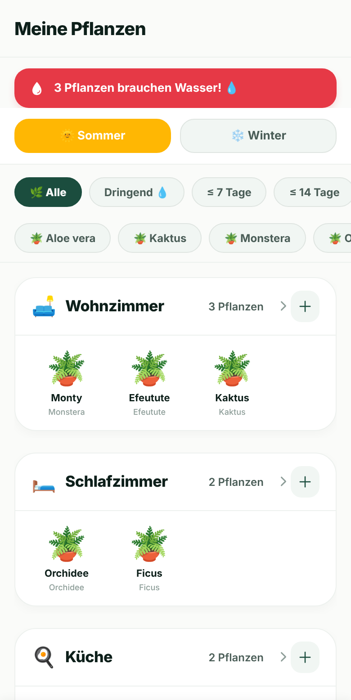
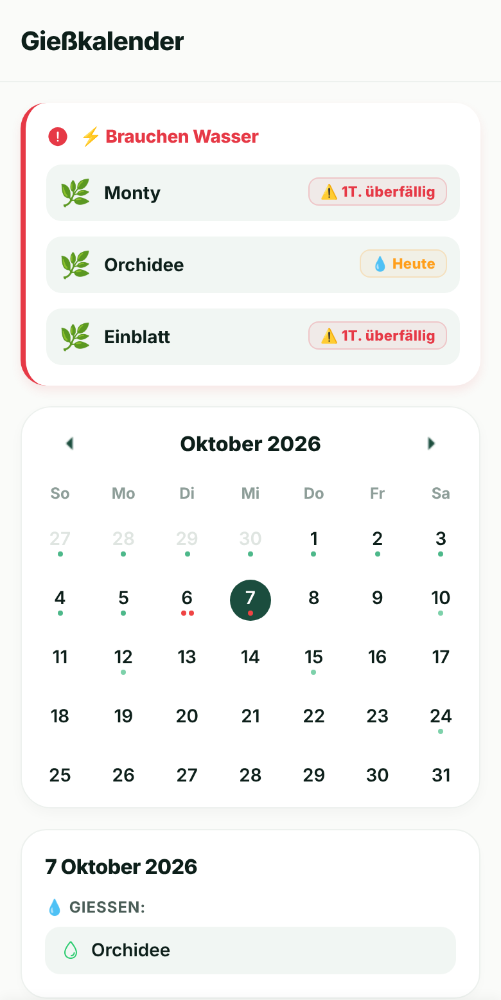
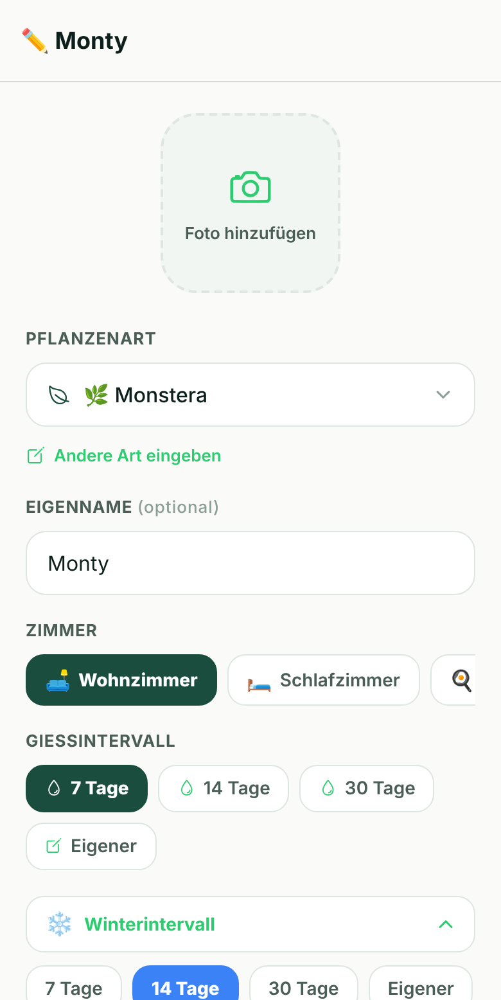
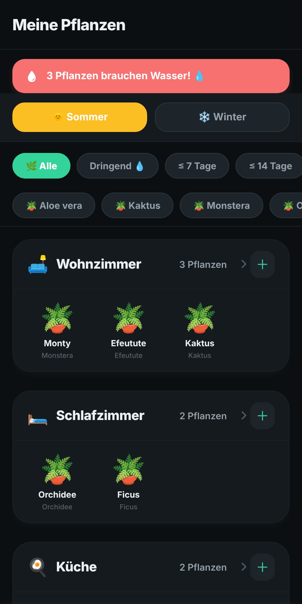
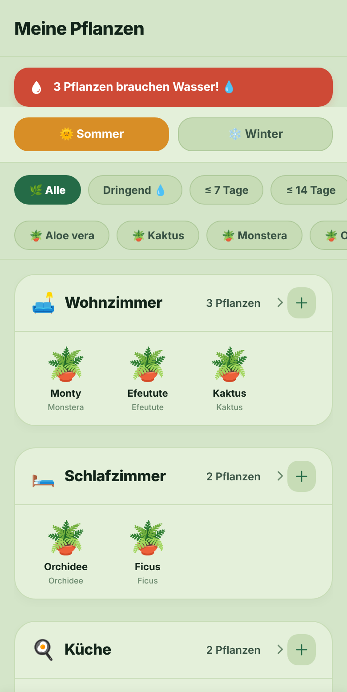

# 🌿 PlantCare

Mobile App (iOS & Android) zur Pflege von Zimmerpflanzen: Pflanzen nach Räumen
organisieren, Gießintervalle planen und rechtzeitig per Push-Benachrichtigung erinnert werden.

**Stack:** React Native 0.81 · Expo SDK 54 · Expo Router · TypeScript · Zustand · NativeWind (Tailwind) · Reanimated · Lottie

<p>
  
  
  
</p>
<p>
  
  
</p>

## Features

- **Räume & Pflanzen** – Pflanzen pro Raum, Art aus einer Liste (25+ Arten) oder frei eingeben, eigenes Foto per Kamera/Galerie
- **Gießplan** – individuelles Intervall pro Pflanze, **Sommer-/Winter-Intervalle** mit globalem Saison-Umschalter und Override pro Pflanze
- **Erinnerungen** – lokale Push-Benachrichtigungen (expo-notifications), werden beim Gießen oder Verschieben automatisch neu geplant
- **Gießkalender** – vergangene, geplante und überfällige Termine farbig markiert, Tagesdetails
- **Schnellaktionen** – Filter „Dringend / ≤ 7 / ≤ 14 Tage“ und nach Art, Quick-Water und „Alle gießen“ mit Lottie-Animation
- **Pflegehistorie & Notizen** pro Pflanze
- **3 Themes** (Light, Dark, Nature) und **4 Sprachen** (Deutsch, Englisch, Ukrainisch, Russisch) – inkl. übersetzter Artnamen und Kalender
- **Backup** – Daten exportieren und wiederherstellen

## Technische Umsetzung

| Bereich | Lösung |
|---|---|
| Navigation | Expo Router (file-based), Tabs + Stack-Screens (`app/`) |
| State | Zustand-Store mit `persist`-Middleware auf AsyncStorage, versionierte Migration (`store/useAppStore.ts`) |
| Benachrichtigungen | `utils/notificationUtils.ts` + `hooks/useNotifications.ts`: planen, abbrechen, neu planen pro Pflanze |
| i18n | eigenes `useT()`-Hook mit typisierten Übersetzungen (`constants/i18n.ts`) |
| Theming | Farb-Tokens pro Theme (`constants/theme.ts`) + `useTheme()` |
| Datumslogik | date-fns, lokalisierte Formate |

```
app/            Screens (Expo Router): (tabs)/, plant/, room/
components/     UI-Komponenten (PlantCard, PlantPot, Shelf, CountdownBadge, …)
hooks/          useT, useTheme, useWatering, useNotifications
store/          Zustand-Store + Typen
constants/      Themes, Übersetzungen, Pflanzenarten
utils/          Datum- und Notification-Helfer
```

## Status

In aktiver Entwicklung (aktuell v1.2.0). Veröffentlichung im App Store und bei Google Play ist geplant.

<!-- Expo-Link / APK hier eintragen, z. B.: **Ausprobieren:** [Expo Go](https://expo.dev/@…) -->

## Lokal starten

```bash
npm install
npx expo start      # QR-Code mit Expo Go scannen
```

Builds über EAS: `eas build --profile preview --platform android` (APK).
